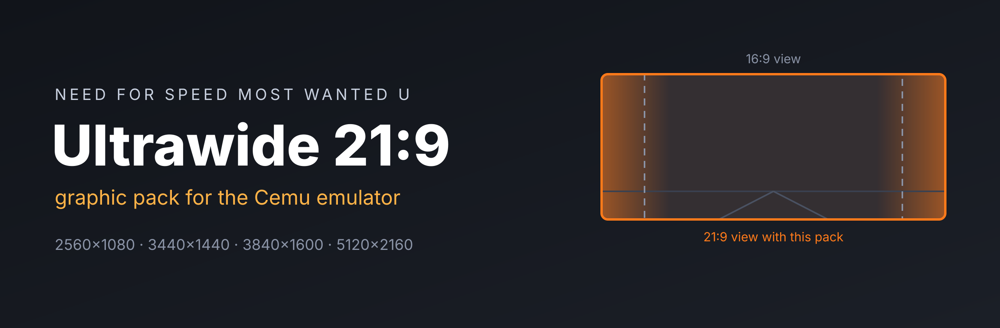
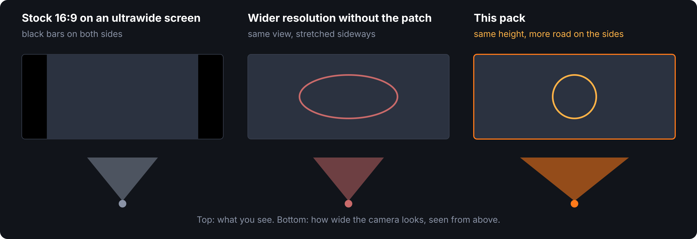
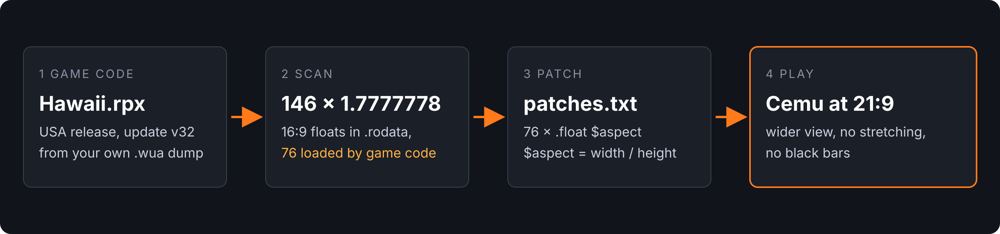

<p align="center">
  
</p>

<p align="center">
  <a href="https://sturq.github.io/nfs-most-wanted-u-ultrawide/"><b>Step-by-step guide</b></a> ·
  <a href="https://github.com/sturq/nfs-most-wanted-u-ultrawide/releases/latest"><b>Download</b></a> ·
  <a href="#use-it-for-other-games">Tools for other games</a>
</p>

<p align="center">
  
  
  
</p>

Native ultrawide for **Need for Speed: Most Wanted U** in the Cemu Wii U emulator. The game renders at your monitor's resolution and the camera actually gets wider, so you see more of the road instead of black bars or a stretched picture.

There was a Resolution pack for this game in the community collection, but no 21:9 option. This pack adds one.

## Features

- Presets for **2560×1080**, **3440×1440**, **3840×1600** and **5120×2160**
- Hor+ field of view: the same vertical view as on a 16:9 screen, more on the left and right
- Menus, garage and map keep their proportions
- Comes with the two small tools used to build the patch, so the same approach works for other Wii U games

<p align="center">
  
</p>

## Requirements

- Cemu 2.x (tested with 2.6)
- Need for Speed: Most Wanted U, **USA release** (title ID `0005000010128800`) with **update v32**
- An ultrawide monitor

The patch is tied to the exact game executable. Other regions and other updates load a different file, so the pack does not show up for them (see [Compatibility](#compatibility)).

## Install

1. Download `NFSMWU_Ultrawide.zip` from the [latest release](https://github.com/sturq/nfs-most-wanted-u-ultrawide/releases/latest).
2. In Cemu, click **File → Open Cemu folder** and open the `graphicPacks` folder.
3. Extract the zip there. You should end up with `graphicPacks/NFSMWU_Ultrawide/rules.txt`.
4. Restart Cemu. It only reads graphic packs on startup.
5. Open **Options → Graphic packs → Need for Speed Most Wanted U → Graphics**.
6. Untick **Resolution**, tick **Ultrawide 21:9** and pick the preset that matches your monitor.
7. Start the game.

The [guide](https://sturq.github.io/nfs-most-wanted-u-ultrawide/) walks through every step with pictures and covers what to do when something looks off.

## How it works

<p align="center">
  
</p>

The game keeps its 16:9 aspect ratio as the float `1.7777778` in its read-only data. A scan of `Hawaii.rpx` found 146 copies of that value, and 76 of them are loaded by the game code (a `lis` followed by `lfs`, `lfd`, `addi` or `lwz` on the same register). Patching only those 76 leaves the unused copies alone.

- `patches.txt` sets the 76 constants to `$aspect`, which each preset defines as width divided by height (2.3703704 for 2560×1080).
- `rules.txt` raises the game's render targets from 1280×720 to the preset resolution. The texture rules come from the community Resolution pack by getdls.
- `moduleMatches = 0xfc370b5b` makes Cemu apply the patch only to the USA v32 executable.

## Compatibility

- **USA, update v32** (module checksum `0xfc370b5b`, `Hawaii.rpx` SHA-256 `360833488ec64056bfae858fcdf9bc7d7f990179252d0867aff623ca1869fef0`): tested and working.
- **Europe, Japan, other updates**: not supported yet. If you own one of these, the tools below can build the patch in a few minutes. Pull requests are welcome.

Tested on Windows 11 with Cemu 2.6 on a Dell Inspiron 3910 (Core i5-12400, GeForce RTX 3050) and an LG 34UC89G at 2560×1080: races, menus, garage and map, nothing stretched. The other presets use the same math but have not been checked on real monitors yet.

## Use it for other games

The `tools` folder has what was used to make this pack. Both need Python 3, the extractor also needs `pip install zstandard`.

**1. Pull the executable out of your `.wua` dump**

```
python tools/wua_extract.py "Game.wua" --list
python tools/wua_extract.py "Game.wua" --list 0005000e10128800_v32/code
python tools/wua_extract.py "Game.wua" 0005000e10128800_v32/code/Hawaii.rpx -o Hawaii.rpx
```

**2. Get the module checksum.** Start the game once in Cemu, close it and search `log.txt` in the Cemu folder for a line like

```
Loaded module 'hawaii' with checksum 0xfc370b5b
```

**3. Find the constants and write the patch**

```
python tools/find_aspect_constants.py Hawaii.rpx
python tools/find_aspect_constants.py Hawaii.rpx --patches patches.txt --checksum 0xfc370b5b --name MyGame_Ultrawide
```

The first command lists every 16:9 constant with how often the code loads it (and the function names, if the executable has symbols). The second writes a `patches.txt` for the ones that are used.

**4. Add a rules.txt.** Copy the game's Resolution pack from the community collection, keep its `[TextureRedefine]` sections, and give every preset an `$aspect` value next to `$width` and `$height`. This repo's `rules.txt` is a working example.

If the picture comes out wrong, patch the constants in groups and test which group moves the camera. Some games keep the aspect ratio in code instead of data, the scan will not find those.

`python tools/test_find_aspect_constants.py` runs a self-check of the scanner on a small hand-built file.

## Troubleshooting

**The pack does not show up.** Check the folder: `graphicPacks/NFSMWU_Ultrawide/rules.txt`, not one folder deeper. Restart Cemu after copying. Packs only show up for the game they are made for, so a European or Japanese copy will not list it.

**The picture is stretched.** The resolution part works but the patch did not apply. Open `log.txt` and look for `Applying patch group 'NFSMWU_Ultrawide'`. If it is missing, your game is not on update v32.

**Black bars on the sides.** The preset does not match your monitor, or Cemu is not in fullscreen (Alt+Enter).

## Legal

This repository contains no game files. You need your own dump of the game. Need for Speed is a trademark of Electronic Arts. This project is not affiliated with Electronic Arts, Nintendo or the Cemu team.

## Credits

- Texture rules from the NFS Most Wanted U Resolution pack by getdls in [cemu_graphic_packs](https://github.com/cemu-project/cemu_graphic_packs) (CC0)
- [Cemu](https://github.com/cemu-project/Cemu) for the emulator and its graphic pack system

## License

[CC0 1.0](LICENSE), same as the community graphic packs. Use it however you like.
